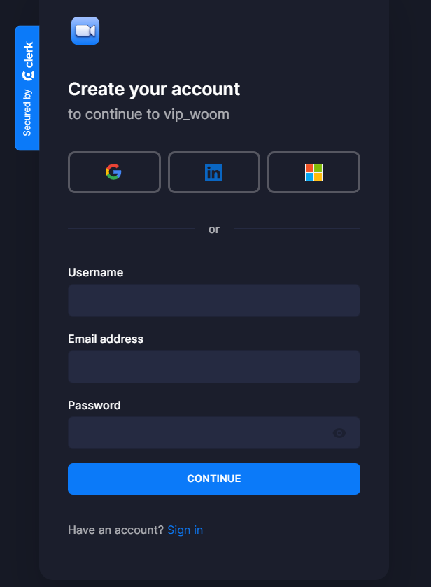
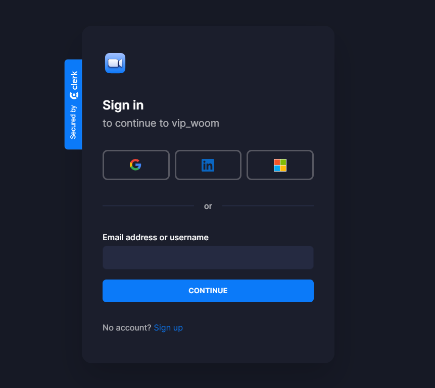
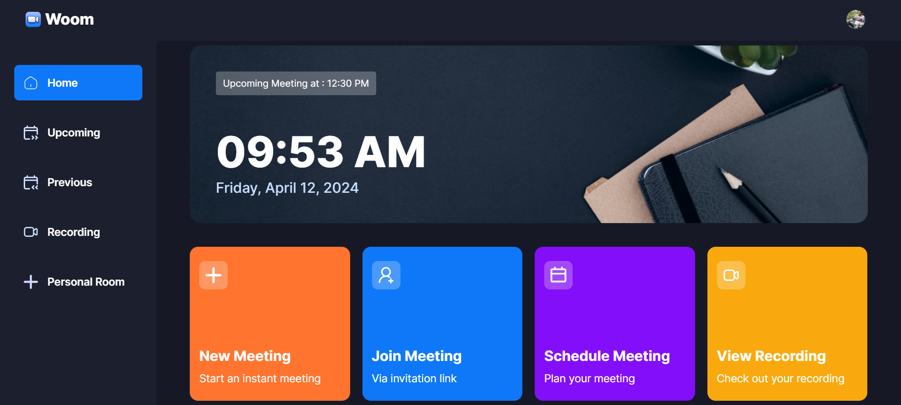
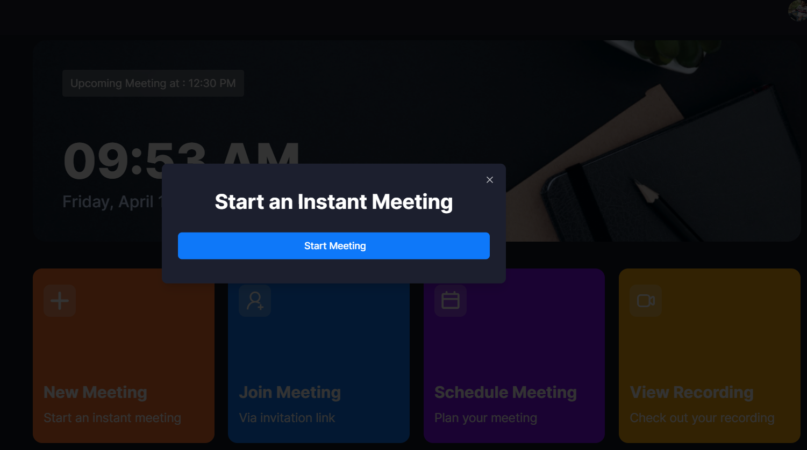
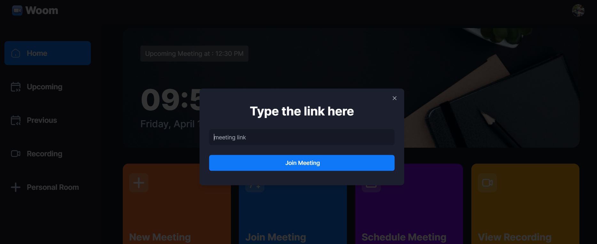
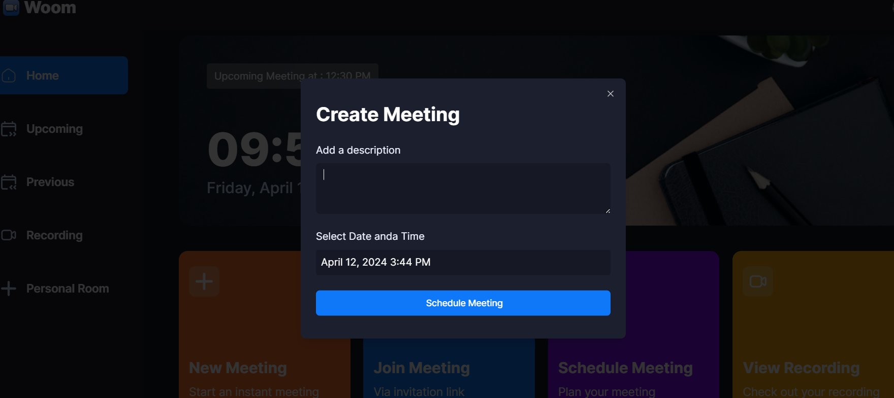
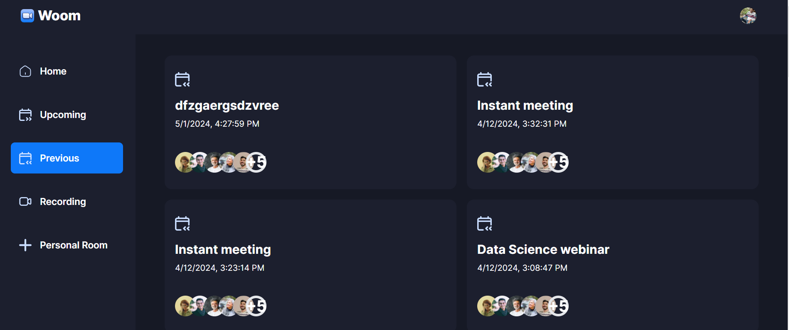
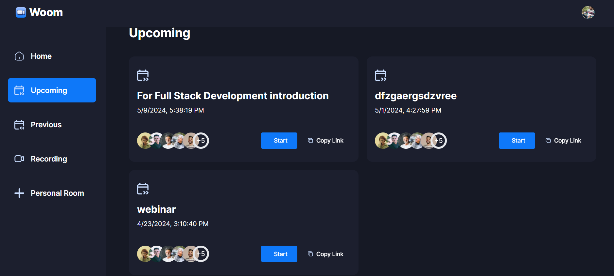
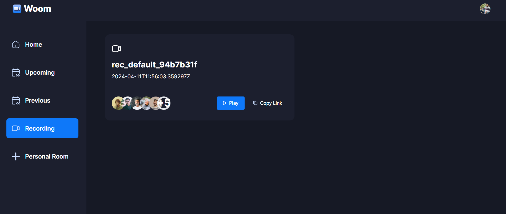
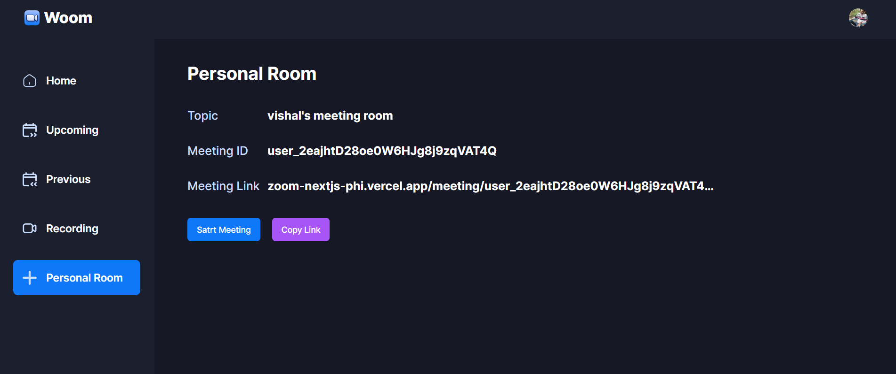

## Live Link

https://zoom-nextjs-phi.vercel.app/sign-in?redirect_url=https%3A%2F%2Fzoom-nextjs-phi.vercel.app%2F

##

##Clerk
Clerk is a complete suite of embeddable UIs, Flexible APIs, and admin dashboards to authenticate and manage your user.

## step-1 Install @clerk/nextjs

npm install @clerk/nextjs

## step-2 Set your environment variables

NEXT_PUBLIC_CLERK_PUBLISHABLE_KEY=pk_test_cG9saXRlLXRocnVzaC00My5jbGVyay5hY2NvdW50cy5kZXYk

CLERK_SECRET_KEY=sk_test_aHSp7gNl47stuISQrkcHkDfXxKgdNzhVtyHa50OA9A

## step-3 Add <ClerkProvider> to your app

import { ClerkProvider } from '@clerk/nextjs'
import './globals.css'

export default function RootLayout({
children,
}: {
children: React.ReactNode
}) {
return (
<ClerkProvider>

<html lang="en">
<body>{children}</body>
</html>
</ClerkProvider>
)
}

## step-4 Add authentication to your app

Create a middleware.ts file
import { authMiddleware } from "@clerk/nextjs";
export default authMiddleware({});

export const config = {
matcher: [ "/((?!.+\\.[\\w]+$|\_next)._)", "/(api|trpc)(._)"]};
